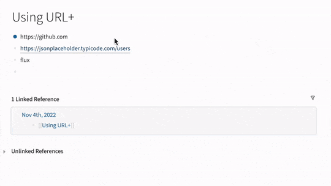

# URL+ Plugin for Logseq

URL+ is a [Logseq](https://logseq.com) plugin written in [ClojureScript](https://clojurescript.org) with [shadow-cljs](https://github.com/thheller/shadow-cljs) as the main tooling.

The plugin retrieves common information based on the last term of an editing block. 

If the last term is a valid URL, metadata or API response is fetched, then the block is modified by applying a selected template. The plugin could also fetch compact dictionary definition of a word term, or attach a few useful links to it.

## Slash Commands

- `URL+ [title](url)`
- `URL+ [title](url) description`
- `URL+ Metadata -> Logseq Attributes`
- `URL+ Metadata -> EDN Code`
- `URL+ Metadata -> JSON Code`
- `URL+ API -> Logseq Attributes`
- `URL+ API -> Logseq Attribute Blocks`
- `URL+ API -> EDN Code`
- `URL+ API -> JSON Code`
- `URL+ Append Definition`
- `URL+ Extract tweet text of twitter.com`
  - Twitter developer access token required
  - Paste the token in the plugin settings panel
  - For details on the Twitter developer programme, see https://developer.twitter.com/en/docs/authentication/oauth-2-0/bearer-tokens
- `URL+ Link Wiktionary URL`

## Why Another URL Formatter?

- Prefer slash command `/` over autoformat
- Need more formatting templates beyond the default `[title](url)`. Customizable templates in plan
- Works for block with multiple terms and even multiline. The plugin only considers the last term without other content in the active editing block
- Presist URL metadata or API response in graph
- Learn Logseq plugin dev in ClojureScript (Sample projects are rare when this project started)

## Plugin Devevelopment in ClojureScript

See [technical notes](./doc/dev-notes.md).
