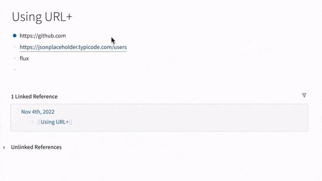
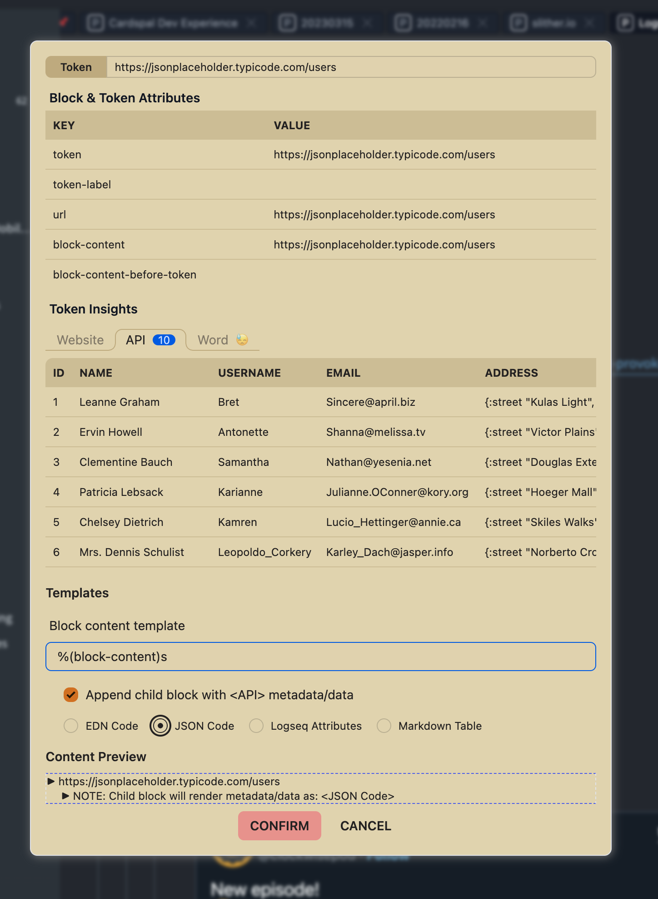

# URL+ Plugin for Logseq

URL+ is a [Logseq](https://logseq.com) plugin written in [ClojureScript](https://clojurescript.org) with [shadow-cljs](https://github.com/thheller/shadow-cljs) as the main tooling.

The plugin takes the last token of an editing block, be it a word or URL, and augments the block with associated metadata in various formats. 

If the last token is a valid URL, metadata or API response is fetched, then the block is modified by applying a selected template. The plugin also fetches compact dictionary definition of a word term, or attach a few useful links to it.

## Slash Commands

Each command can be enabled or disabled individually in the plugin settings.

- `URL+ [title](url)`
- `URL+ [title](url) description`
- `URL+ Metadata -> Logseq Attributes`
- `URL+ Metadata -> EDN Code`
- `URL+ Metadata -> JSON Code`
- `URL+ API -> Logseq Attributes`
- `URL+ API -> Logseq Attributes Block`
- `URL+ API -> EDN Code`
- `URL+ API -> JSON Code`
- `URL+ Append Word Definition`
  - Uses [dictionaryapi.dev](https://dictionaryapi.dev), a free community-run
    service with no uptime guarantee
- `URL+ Inspector ...`
  - Opens the inspector UI for token insights and template customization
  

## Compatibility

URL+ targets **Logseq OG** — the file-based (Markdown) version. Logseq split
into two products in April 2026, and the database version has a different
plugin API surface; a port is not yet available.

## Why Another URL Formatter?

- Prefer slash command `/` over autoformat
- Need more formatting templates beyond the default `[title](url)`
- Works for block with multiple terms and even multiline. The plugin only considers the last term without other content in the active editing block
- Persist URL metadata or API response in graph
- Learn Logseq plugin dev with ClojureScript + Rum + Babashka + tailwindcss (Sample ClojureScript based plugin projects are rare when this project started)

## Plugin Devevelopment in ClojureScript

See [technical notes](./doc/dev-notes.md).
