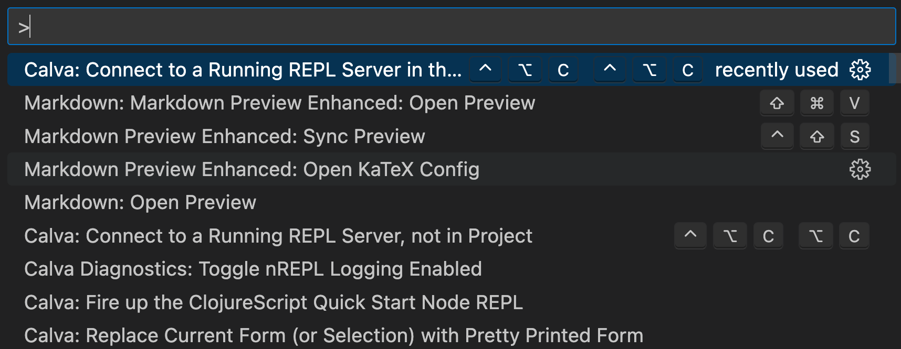
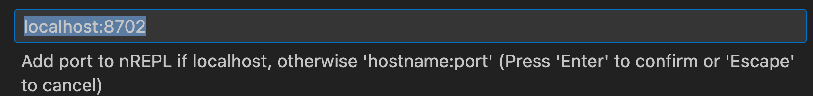
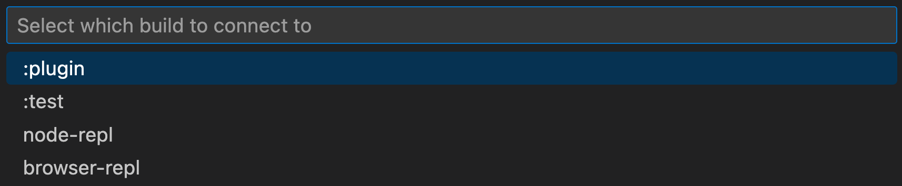
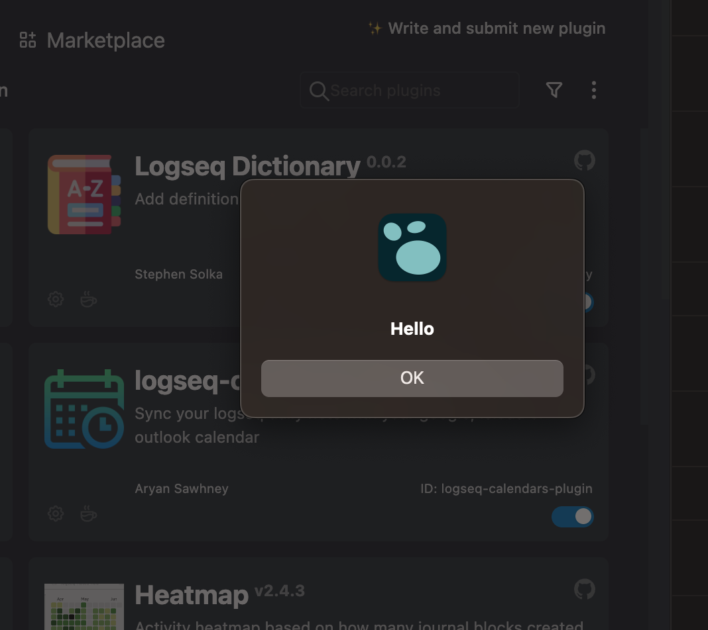
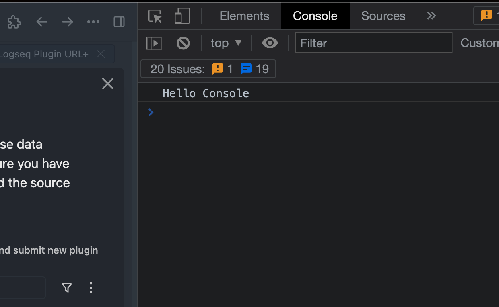

# Developing this plugin

A Logseq plugin in ClojureScript, built with shadow-cljs, Rum and Tailwind +
daisyUI, driven by [babashka](https://babashka.org) tasks.

Targets **Logseq OG** (file-based graphs) on macOS. Verified against Logseq
0.10.15.

- [Official plugin samples](https://github.com/logseq/logseq-plugin-samples)
- [`@logseq/libs` API docs](https://logseq.github.io/plugins/)

Part 1 is setup and the facts that bind everyone. Parts 2 and 3 cover what
differs for coding agents and for people.

---

## Part 1 - Common

### Prerequisites

```
./script/bootstrap.sh
```

Plain POSIX `sh`, no dependencies. It reports what is missing and hands off to
`bb doctor`, which checks the JDK, node, yarn, clj-kondo and `node_modules`.
Exit 0 means the toolchain is complete. Once babashka is installed, `bb doctor`
is the check to re-run.

**shadow-cljs needs JDK 21+.** Anything older dies with
`UnsupportedClassVersionError`. You do not need to set `JAVA_HOME`: the tasks
search `JAVA_HOME`, `/Library/Java/JavaVirtualMachines`, Homebrew and SDKMAN,
and take the lowest qualifying JDK, matching CI (Java 21, Node 22). A system
default of JDK 17 is fine. `bb java` shows the choice. On JDK 24+ the tasks add
`--sun-misc-unsafe-memory-access=allow`, which is why you may see `NOTE: Picked
up JDK_JAVA_OPTIONS`.

### The edit -> reload loop

**Hot reload does not work.** `:after-load entry/reload` is wired and the CLJS
runtime attaches, but a changed bundle does not update the running plugin. Use
`bb reload` after every change.

Once:

```
yarn install
```

Quit Logseq, then relaunch it with a debugging port:

```
# env -u matters: an integrated terminal (VS Code, Cursor) exports
# ELECTRON_RUN_AS_NODE=1, which makes the Electron binary run as plain Node and
# reject the flag with "bad option: --remote-debugging-port".
env -u ELECTRON_RUN_AS_NODE -u ELECTRON_NO_ATTACH_CONSOLE \
  /Applications/Logseq.app/Contents/MacOS/Logseq --remote-debugging-port=9223 &
```

Then:

```
bb dev            # the watch; blocks. From a tool call: `bb dev agent`
bb sideload       # register dist/ with the running Logseq
```

Enable developer mode in Logseq and confirm **URL+ (dev)** appears under
Plugins. Each change after that:

```
# save a file -> the watch rebuilds dist/ (~10s)
bb reload         # push it into the running Logseq
```

`bb reload` prints the slash-command count, which doubles as a smoke test.

Without a debugging port, load the plugin by hand: Plugins -> Load unpacked
plugin -> the project root (the folder with `package.json` *and* `dist/`).
Reloading is then also manual, from the plugin panel. Console:
`Option Command + i`.

### The dev plugin copy

`bb sideload` builds a second plugin directory, `~/logseq-url-plus-dev` by
default, override with `DEV_PLUGIN_DIR`:

- `package.json` derived from this project's, with `logseq.id` set to
  `logseq-url-plus-dev`
- `dist` symlinked to this project's `dist/`, so the watch's output is picked
  up without a second sync step

The distinct id is required. Logseq will not run two plugins with the same id
and rejects a colliding registration, and settings are keyed by id
(`~/.logseq/settings/<id>.json`), so dev settings stay out of the installed
plugin's.

The task is idempotent: re-run it to refresh `package.json` after a version
bump.

### Tasks

`bb tasks` lists them all.

| Task | Purpose |
| --- | --- |
| `bb doctor` | Check the toolchain |
| `bb dev` | Watch CLJS + Tailwind, re-running tests on save (blocks) |
| `bb dev agent` | The same watch, detached, waits until ready |
| `bb dev-logs` | Show the detached watch log |
| `bb stop` / `bb restart` | Stop or replace a running watch |
| `bb sideload` | Create/refresh the dev plugin copy and register it |
| `bb reload` | Reload the side-loaded plugin |
| `bb repl-status` | Is the `:plugin` CLJS runtime attached? |
| `bb test` | Unit + integration suites |
| `bb lint` | clj-kondo over `src`, keep at zero warnings |
| `bb check-css` | Verify every daisyUI class used by the UI still exists |
| `bb build` | Release bundle into `dist/` |
| `bb ci` | lint, check-css, test, build |
| `bb deps` | Dependency updates (exit 1 = updates available) |
| `bb release` | Run CI, then tag and push |

The tasks refuse known footguns: a second watch, or a build while one is
running. While a watch is up, `dist/` is served on <http://localhost:8080>, the
shadow-cljs dashboard on <http://localhost:9630>, and nREPL on port **8702**.

### Constraints and gotchas

#### shadow-cljs is pinned to 3.1.2 while rum is 0.12.11

shadow-cljs 3.5.2 breaks `rum/defc` argument passing: components receive the
raw `arguments` object. The Inspector renders with `[object Arguments]` in the
token field, empty attribute tables and no tabs. Nothing fails at compile time
and no test catches it, because neither test tier renders a component. rum
0.12.11 is the latest release and upstream has been dormant since July 2023.

#### `bb build` and `bb dev` both own `dist/`

`prep` deletes `dist/`, which a running watch is writing into. `prep` refuses
while a watch is running; `ALLOW_BUILD_WITH_WATCH=1` overrides it. The watch
rebuilds `dist/` on every save, so a separate build is only needed to verify
the release bundle.

#### Tailwind's `--watch` quits when stdin is not a TTY

The tasks use `--watch=always`. With plain `--watch`, Tailwind exits whenever
it is backgrounded, piped, run under CI or driven by an agent, producing **no
`dist/styles.css` at all**, silently, with exit status 0. It works in an
interactive terminal, which is what makes it easy to miss. `bb dev agent`
therefore waits for `dist/styles.css`, not just for both builds to report
`Build completed`.

#### `Browserslist: caniuse-lite is outdated` cannot be fixed here

Tailwind 3.4.0 bundles browserslist and caniuse-lite inside
`node_modules/tailwindcss/peers/index.js`, so the data is frozen in the
package. `npx update-browserslist-db` cannot reach it and removes packages
without silencing anything. `bb deps` does not call it. Cosmetic; goes away
with Tailwind v4.

#### Stale settings keys

`~/.logseq/settings/logseq-url-plus.json` keeps keys from removed features
(`TwitterAccessToken`, `UrlPlusExtractTweet`). Harmless.

### Testing

`bb test` runs both tiers (shadow-cljs `:node-test`, `:autorun true`):

- **Unit** - pure functions in `src/test/*_spec.cljs`.
- **Integration** - `integration_spec.cljs` drives the real
  `core/handle-slash-cmd` against the fakes in `harness.cljs`: a `js/logseq`
  stub recording every Editor/UI call, and a fixture-backed `js/fetch`.

Two failure classes neither tier catches, which is what the
[manual checklist](#manual-smoke-checklist) is for:

1. **A release that fails on load.** The `:advanced` build munges every name,
   and `ls.cljs` reaches Logseq's API by property access that survives only
   because `:infer-externs :auto` preserves it. Neither tier loads the built
   bundle.
2. **A rendering bug.** Neither tier renders a component. The entire Inspector
   was once broken with all tests green.

True end-to-end against a running Logseq is partly reachable now: slash
commands can be driven with synthetic input, see
[Driving keystrokes over CDP](#driving-keystrokes-over-cdp). It is not wired
into `bb test`. Logseq's own suite,
[`clj-e2e`](https://github.com/logseq/logseq/tree/master/clj-e2e), uses Wally
over Playwright Java driven by babashka.

### Release

- Update `version` in `package.json`.
- `bb release` runs CI, tags that version and pushes. The tag triggers the
  workflow that builds the release the Marketplace picks up.
- A tag containing a hyphen (`0.3.0-rc1`) publishes as a prerelease, so the
  release path can be rehearsed without reaching users.
- The zip should contain `dist/`, `package.json` and `README.md` only.

`@logseq/libs` is imported in exactly one place, `entry.cljs`, the build's
`:init-fn`. Importing it installs the `logseq` global and needs browser
globals, so keeping it out of `core` and `ls` is what lets those namespaces
load under Node for the integration tier.

Marketplace submission, for reference only since the plugin is already listed:
[Marketplace README](https://github.com/logseq/marketplace/blob/master/README.md)
-> fork [logseq/marketplace](https://github.com/logseq/marketplace) -> update
`packages/logseq-url-plus` -> PR. The
[rlhk/marketplace](https://github.com/rlhk/marketplace) fork dates from 2023
and must be synced with upstream first.

### Dependencies

`bb deps` checks Node (npm-check-updates) and Clojure/Script
([antq](https://github.com/liquidz/antq)), and exits 1 when updates exist. It
pulls antq in with `-Sdeps`, so it needs no `~/.clojure/deps.edn` alias. Update
Clojure deps in `shadow-cljs.edn`, Node deps in `package.json`. Read the
shadow-cljs pin above first.

---

## Part 2 - Coding agents

`AGENTS.md` is the canonical agent contract: exit codes per task, coding
conventions, and the `ls.cljs` interop rules that `:advanced` compilation
depends on. This section covers driving the app.

### Start the watch with `bb dev agent`

`bb dev` never returns, so it will hang a tool call. `bb dev agent` runs the
same watch detached, waits until both builds report ready and
`dist/styles.css` exists, prints a status block and exits 0. `bb dev-logs`
shows the output. `bb restart agent` takes the same mode.

`bb stop` ends both the shadow-cljs server and the detached wrapper. Stopping
only the server leaves the babashka process orphaned.

### Check REPL readiness before evaluating

The plugin's CLJS runtime lives inside a Logseq iframe, so it does not exist
until Logseq is running with the plugin loaded. Three states:

1. **watch alive** - a shadow-cljs worker exists for the build
2. **build ready** - that worker compiled successfully
3. **runtime attached** - a live JS runtime is connected

```
$ bb repl-status
server=running
:plugin watch=running runtimes=1
:test watch=running runtimes=0
ready=yes
```

If `:plugin runtimes=0`, do **not** attach or evaluate. You would be talking to
the JVM Clojure REPL instead of the plugin. `:test runtimes=0` is normal; that
build spawns a runtime per run and exits.

### Driving Logseq over CDP

`script/logseq-cdp.mjs` evaluates JavaScript in the running app, reads blocks
back, takes screenshots and sends input. `bb sideload` and `bb reload` are
built on it. Launch Logseq with the debugging port as shown in
[Part 1](#the-edit---reload-loop), then:

```
node script/logseq-cdp.mjs targets
node script/logseq-cdp.mjs eval "LSPluginCore.registeredPlugins.get('logseq-url-plus-dev').options.version"
node script/logseq-cdp.mjs screenshot /tmp/logseq.png
```

Override the port with `LOGSEQ_CDP_PORT` (default 9223).

- **`LSPluginCore.unregister` deletes the plugin folder** for anything under
  `~/.logseq/plugins`: `unload(true)` emits `unlink-plugin` when
  `isInstalledInDotRoot`. Never call it on a Marketplace install. `disable` is
  safe and reversible. `bb sideload` keeps the dev copy outside
  `~/.logseq/plugins` for this reason.
- `register` persists the path into `~/.logseq/preferences.json` under
  `externals`. Snapshot that file before testing.

### Driving keystrokes over CDP

```
node script/logseq-cdp.mjs type '<text>'
node script/logseq-cdp.mjs key <Name>        # Enter, Escape, Backspace, Arrow*
```

Place the caret with `logseq.api.edit_block(uuid, {pos: n})` rather than
clicking coordinates. Three requirements, each of which silently does nothing
otherwise:

- **The window must be focused.** A backgrounded Logseq reports
  `document.visibilityState === "hidden"` and refuses to enter editing mode, so
  `edit_block` no-ops. Run
  `osascript -e 'tell application "Logseq" to activate'` first.
- **`keyDown` must not carry `text`.** Both `keyDown`-with-text and `char`
  insert, so sending both types every character twice.
- **`code` and `windowsVirtualKeyCode` are required.** Logseq opens its command
  menu from a keydown handler that reads the key code; a bare `char` event
  inserts the `/` and no menu appears.

Driving a slash command end to end:

```
node script/logseq-cdp.mjs eval "logseq.api.edit_block('<uuid>',{pos:29})"
node script/logseq-cdp.mjs type " /URL+ [title](url)"    # note the leading space
node script/logseq-cdp.mjs key Enter
```

### Slash-command caret semantics

At the moment a slash-command handler runs:

- `getEditingBlockContent` has the typed `/URL+ ...` text **already removed**
- `getEditingCursorPosition().pos` indexes **that cleaned string**
- both are stable; re-reading inside `setTimeout(..., 0)` gives identical
  values

Measured at five caret positions in Logseq 0.10.15. The reason is visible in
the registry: `@logseq/libs` rewrites a callback slash command into an ordered
action list.

```
node script/logseq-cdp.mjs eval "(()=>{const a=logseq.api.get_state_from_store('plugin/installed-slash-commands');const c=a['logseqUrlPlusDev'];return JSON.stringify(c[Object.keys(c)[0]]);})()"

[["clearCurrentSlash", false, {...}], ["restoreSavedCursor", {...}], ["hook", ...]]
```

Logseq clears the typed text and restores the cursor before calling the plugin.
Anything that reorders those steps breaks cursor-aware token selection.

Two behaviours that follow:

- **Logseq only opens the command menu when `/` follows a space** or the start
  of the block. Typing `/` straight after a URL inserts a literal slash.
- **That space survives** `clearCurrentSlash`, which removes only the command
  text, so a mid-block invocation leaves the block one space wider.

### What you can and cannot verify

Slash-command handlers are events inside the plugin sandbox
(`Editor["on" + hookName]`), so they cannot be fired with `caller.call` or
`callUserModel`, but they can be driven with synthetic input as above.

Not covered: whether a command chosen with the **mouse** behaves like one
chosen with Enter, and anything about how the UI looks. Take a screenshot and
read it rather than inferring appearance from state.

### Agent skills worth borrowing from

None are wired into this repo; a checkout works with `bb` alone.

- **[logseq/logseq `.agents/skills`](https://github.com/logseq/logseq/tree/master/.agents/skills)**
  - same language, build tool and host app, no MCP server. The
  watch/build/runtime readiness split above comes from their
  [`logseq-repl`](https://github.com/logseq/logseq/tree/master/.agents/skills/logseq-repl)
  skill.
- **[humorless/clj-native-agent](https://github.com/humorless/clj-native-agent)**
  (formerly `clojure-dev-skill`) - babashka and rewrite-clj skills for
  structural edits and REPL inspection. Every one drives `brepl`, and the
  README does not mention ClojureScript or shadow-cljs, so they do not drop in
  unmodified.
- **[bhauman/clojure-mcp](https://github.com/bhauman/clojure-mcp)** - edits
  forms by type and name rather than text match. `list_nrepl_ports` discovers
  shadow-cljs REPLs.
- **[Calva Backseat Driver](https://github.com/BetterThanTomorrow/calva-backseat-driver)**
  - an MCP server inside Calva reusing its existing REPL connection.

---

## Part 3 - Human coders

### The REPL, via Calva

Check `bb repl-status` first; the readiness rules in
[Part 2](#check-repl-readiness-before-evaluating) apply here too. Then connect
Calva to the shadow-cljs nREPL on port 8702, build `:plugin`.






```clojure
(in-ns 'core)
config/slash-commands          ; the registered commands
(js/alert "Hello")
(js/console.log "Hello Console")
(ls/show-msg "Hello Logseq")   ; show-msg lives in ns `ls`, not `core`
```





The rich comment block at the end of `ui.cljs` has expressions for remounting
the panel and inspecting `@plugin-state`. Evaluate with `option + enter`.

Editor setup: VS Code +
[Calva](https://marketplace.visualstudio.com/items?itemName=betterthantomorrow.calva).
Its [Paredit](https://calva.io/paredit/) is what keeps parens balanced through
structural edits.

### Manual smoke checklist

Run before tagging a release. It is the only coverage for the two failure
classes in [Testing](#testing), and every step needs real keystrokes. Start the
watch, `bb sideload`, then in a scratch block:

1. `https://youtu.be/dQw4w9WgXcQ` + `/URL+ [title](url)` -> the real video
   title.
2. A `bit.ly` or `t.co` link -> resolves rather than throwing.
3. `https://jsonplaceholder.typicode.com/posts/1` + `/URL+ API -> JSON Code`
   -> JSON block. Confirm in DevTools that a metadata command issues **one**
   request, not two.
4. An unreachable host -> a visible message, no unhandled rejection.
5. `/URL+ Append Word Definition` on `prodigy` -> a definition; on a nonsense
   word -> "no definition found". dictionaryapi.dev is an unfunded community
   service, so a 5xx shows as "dictionary service unavailable" and is not a
   plugin bug.
6. `/URL+ Inspector ...` -> modal opens, all three tabs render, Esc and
   backdrop-click close it, Confirm writes the block.
7. Empty block + any command -> graceful message, no throw.
8. `bb reload` -> each slash command appears once (12 total).
9. Multi-URL block: `alpha https://example.com middle https://github.com omega`.
   Cursor at the **end of** the first URL, `/URL+ [title](url)` -> the first is
   formatted, the rest untouched. Repeat on the second. Mid-URL does not work:
   Logseq needs a space before `/`, which splits the URL.
10. `see https://example.com for details`, cursor at the end -> the sole URL is
    used even though the cursor is on a word.
11. `URL+ All links in block` on a block mixing a bare URL, an existing
    markdown link and an unreachable URL -> only the bare one is converted.
